# ShopVerse Daily ETL Pipeline 

## Overview

This project implements a **daily batch ETL pipeline using Apache Airflow** for an e-commerce platform **ShopVerse**.
The pipeline ingests daily CSV/JSON files, stages them in PostgreSQL, loads star-schema tables, performs data quality checks, applies branching logic, and sends alerts on failure.


---

# 1. How to Set Up Airflow Variables & Connections

## 1.1 Airflow Variables

Create these variables in:

```

Airflow UI → Admin → Variables

```

### Variable 1 — Base Path

Key: `shopverse_data_base_path`  
Value: `/opt/airflow/data`

Used for locating landing zone files.

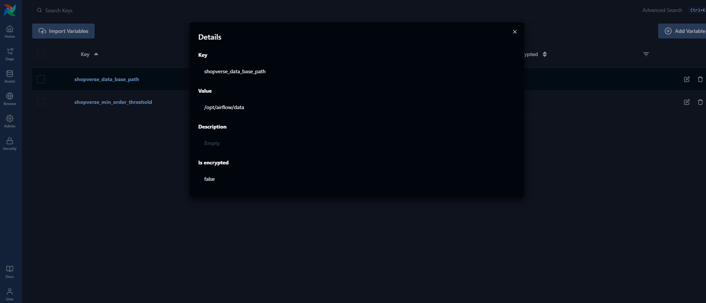
---

### Variable 2 — Minimum Order Threshold

Key: `shopverse_min_order_threshold`  
Value: `10`

Used in branching logic to check if daily order volume is low.

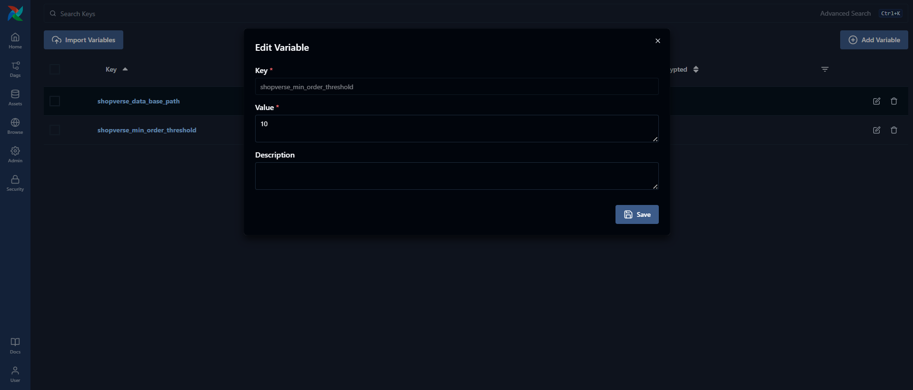
---

## 1.2 Airflow Connection — postgres_dwh

Create via:

```

Airflow UI → Admin → Connections → + Add

```

Connection details:

- Conn ID: `postgres_dwh`
- Conn Type: Postgres
- Host: `airflow-postgres-1`
- Schema / Database: `dwh_shopverse`
- Login: `airflow`
- Password: `airflow`
- Port: `5432`

This connection is used by all ETL tasks to load/transform/query PostgreSQL.

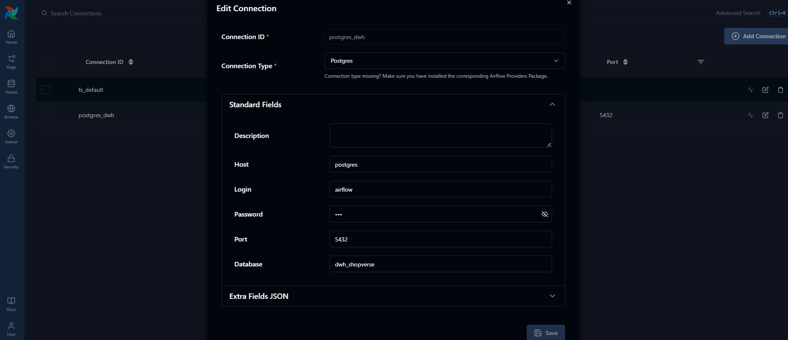
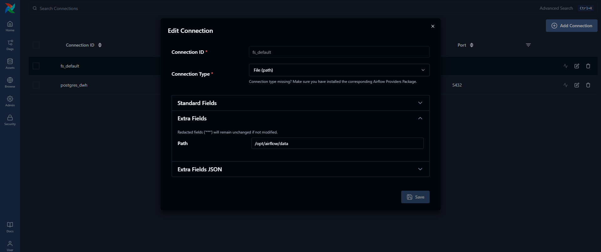
---

# 2. How to Place Input Files

Every day, the upstream systems drop **three files** into the Airflow landing directory.

Place them exactly like this:

```

/opt/airflow/data/landing/customers/customers_YYYYMMDD.csv
/opt/airflow/data/landing/products/products_YYYYMMDD.csv
/opt/airflow/data/landing/orders/orders_YYYYMMDD.json

```

### Example (for date 2025-12-08)

```

/opt/airflow/data/landing/customers/customers_20251208.csv
/opt/airflow/data/landing/products/products_20251208.csv
/opt/airflow/data/landing/orders/orders_20251208.json

```

---

### File Formats

#### Customers CSV

```

customer_id,first_name,last_name,email,signup_date,country

```

#### Products CSV

```

product_id,product_name,category,unit_price

````

#### Orders JSON

```json
{
  "order_id": 1,
  "order_timestamp": "2025-12-09T10:00:00Z",
  "customer_id": 1,
  "product_id": 3,
  "quantity": 2,
  "total_amount": 40.00,
  "currency": "USD",
  "status": "Completed"
}
````

---

# 3. How to Trigger the DAG & Backfill Older Dates

The DAG is scheduled to run daily at **01:00 AM**, but you can also manually trigger it.

---

## 3.1 Trigger the DAG from Airflow UI

```
Airflow UI → DAGs → shopverse_daily_pipeline → Trigger DAG
```

---

## 3.2 Trigger DAG via CLI

Enter Airflow scheduler container:

```bash
docker exec -it airflow-airflow-scheduler-1 bash
```

Trigger the DAG:

```bash
airflow dags trigger shopverse_daily_pipeline
```

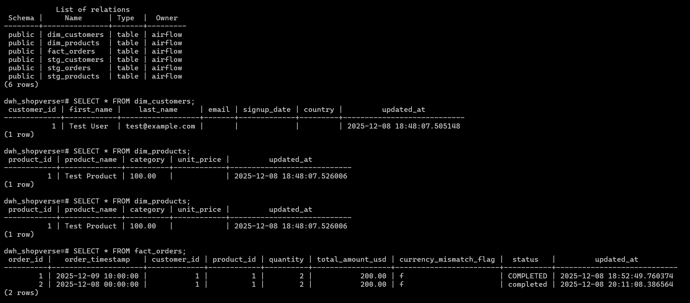


---

## 3.3 Backfill for Historical Dates

Backfilling allows processing older days automatically based on logical date.

Example: Backfill 5 days:

```bash
airflow dags backfill shopverse_daily_pipeline -s 2025-12-01 -e 2025-12-05
```

The pipeline will automatically look for:

```
customers_20251201.csv … customers_20251205.csv
products_20251201.csv … products_20251205.csv
orders_20251201.json … orders_20251205.json
```
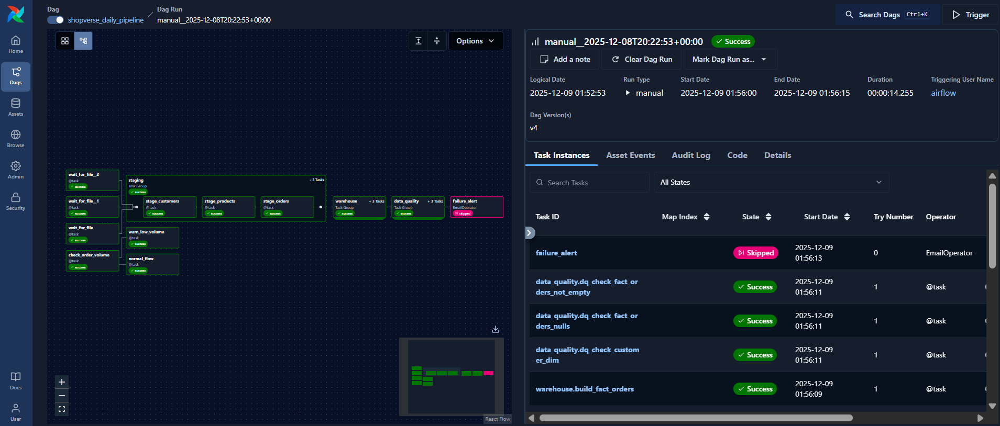

---

# 4. Data Quality Checks (DQ Checks)

Your pipeline implements **three required DQ checks** inside the `data_quality` TaskGroup.

---

### DQ Check 1 — dim_customers not empty

```sql
SELECT COUNT(*) FROM dim_customers;
```

Fails if the table has 0 rows.

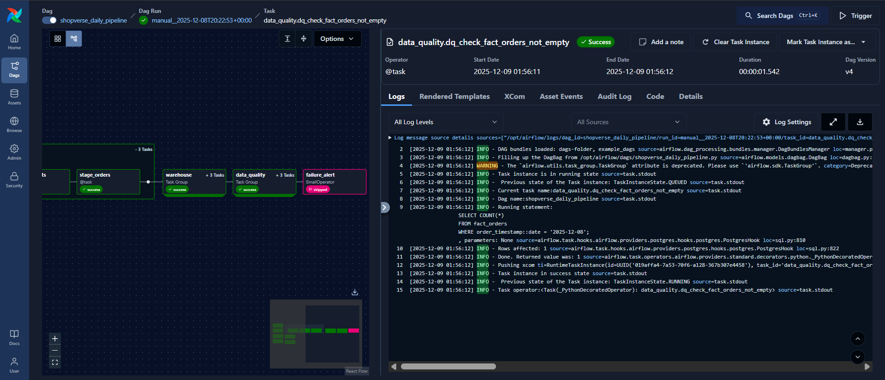

---

### DQ Check 2 — fact_orders contains rows for the execution date

```sql
SELECT COUNT(*)
FROM fact_orders
WHERE order_timestamp::date = '{{ logical_date }}';
```
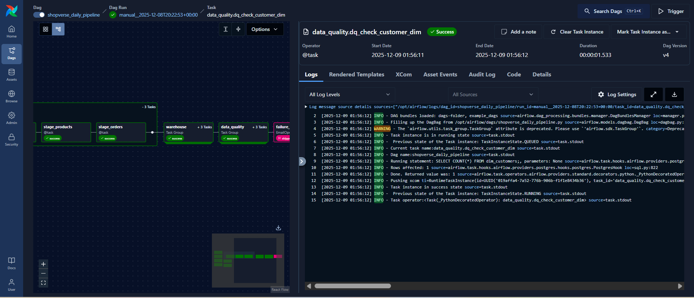


---

### DQ Check 3 — No null foreign keys in fact_orders

```sql
SELECT COUNT(*)
FROM fact_orders
WHERE customer_id IS NULL
OR product_id IS NULL;
```

Fails if invalid rows exist.

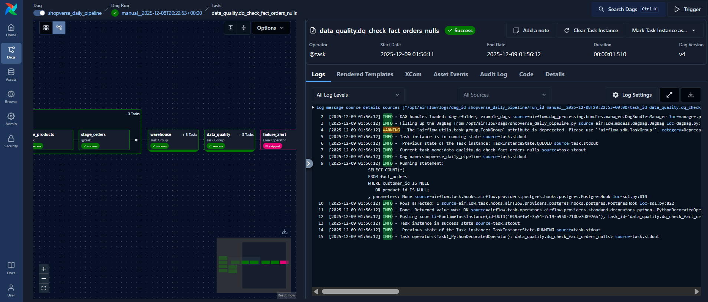

---

### Failure Behavior

* The offending task raises an **Exception**
* The entire DAG **fails**
* `failure_alert` **EmailOperator** sends a notification

---

# Branching Logic

After loading the warehouse tables, the task `check_order_volume` checks:

```sql
SELECT COUNT(*)
FROM fact_orders
WHERE order_timestamp::date = '{{ logical_date }}';
```
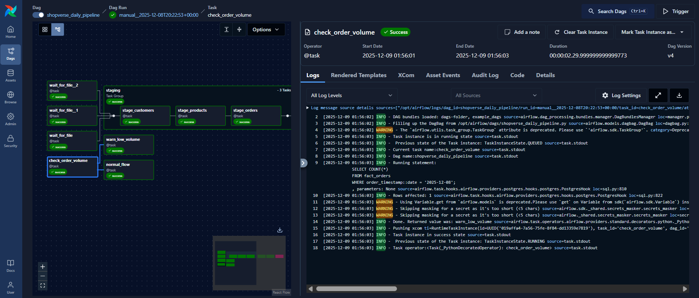

If count < variable threshold (`shopverse_min_order_threshold`):

→ Branch to: `warn_low_volume`

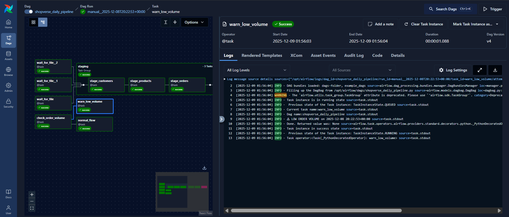


Else:

→ Branch to: `normal_flow`

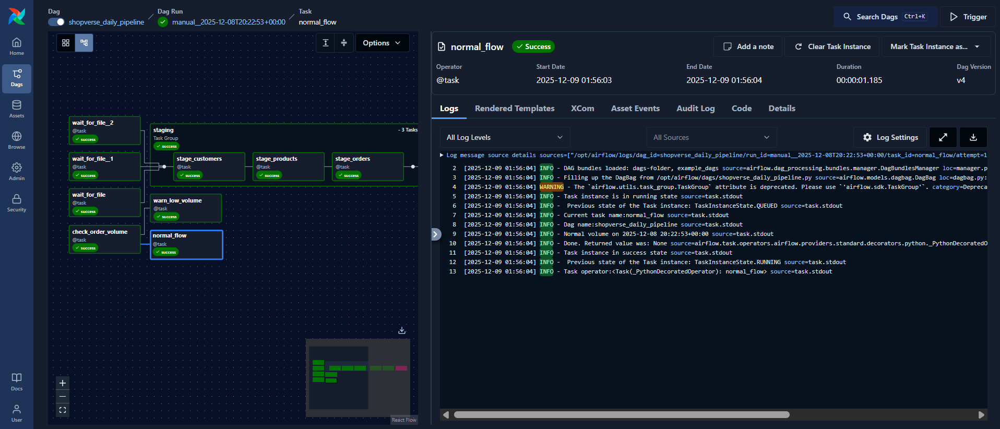

---


